# aegisapi
이지스 오픈 api

### Spring Boot
The following guides illustrate how to use some features concretely:

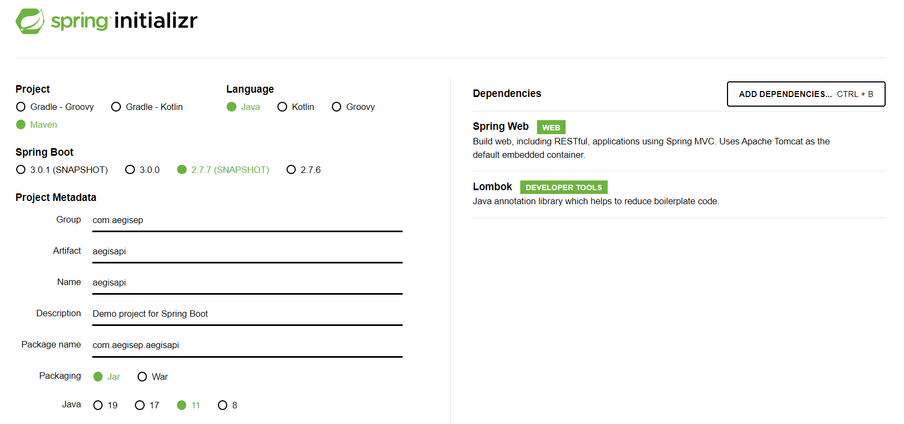

# VPC
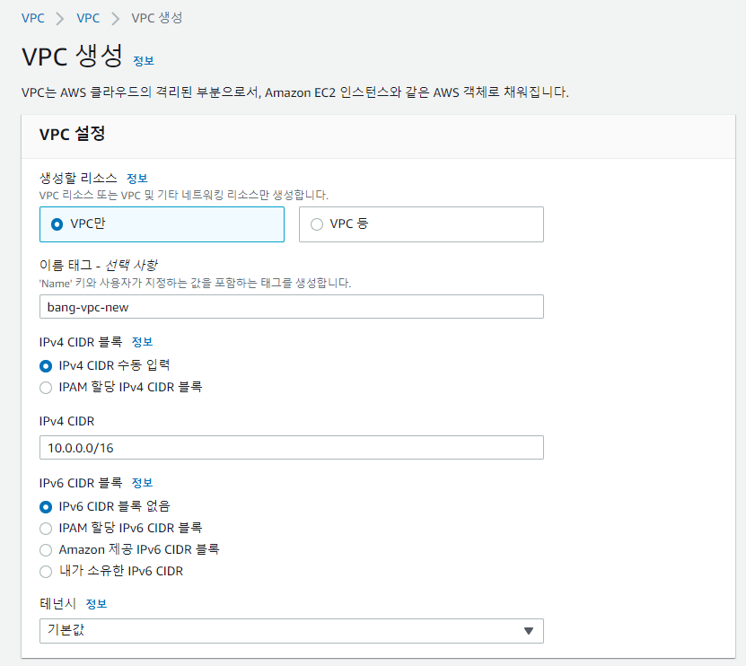
vpc 이름은 new-vpc

# Subnet
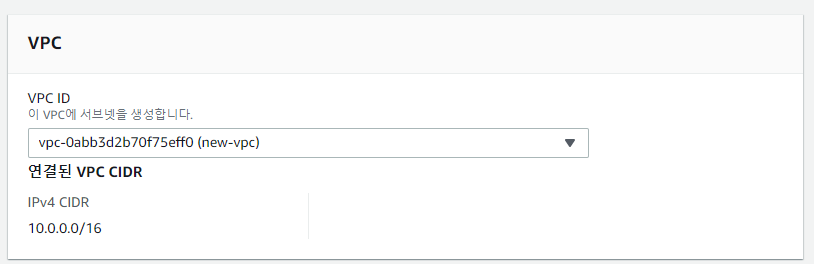

서브넷은 총 4개 만드는데 public01, private01은
같은 가용영역으로 만든다.
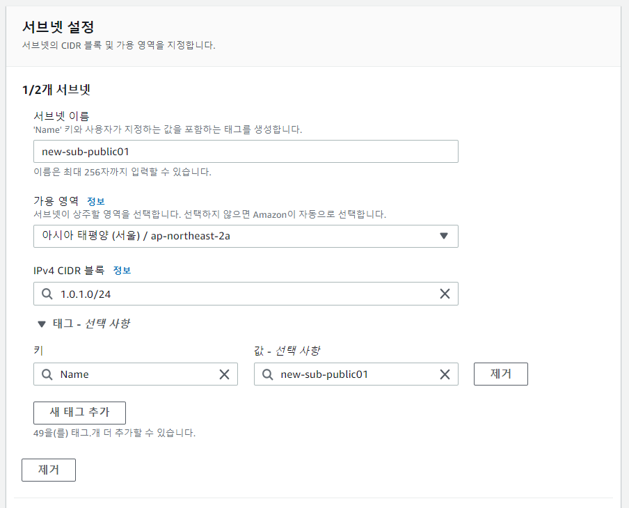

public01, private01 서브넷은 가용영역을 ap-northeast-2a에 만들고,\
public02, private02 서브넷은 가용영역을 ap-northeast-2b에 만든다.\
다 만들고 나면 아래와 같이 목록이 생성되어야 한다.
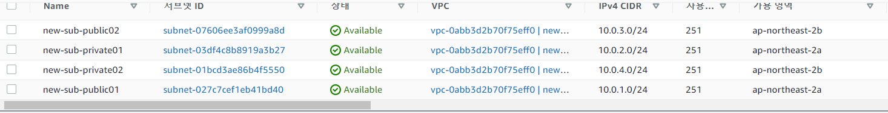

# 인터넷 게이트웨이
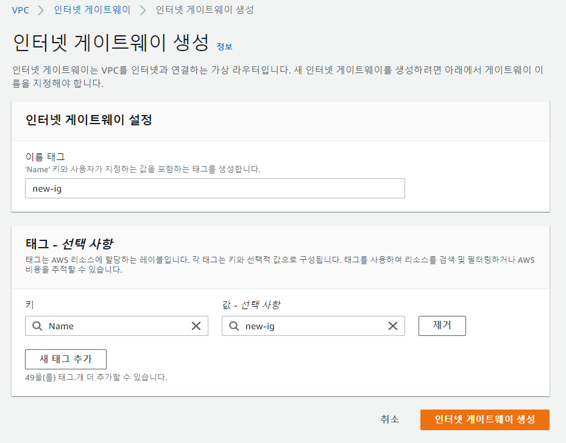

# NAT 게이트웨이
※ nat 게이트웨이를 생성 하기 전 인터넷 게이트웨이가 VPC에 연결 되어 있어야 한다.

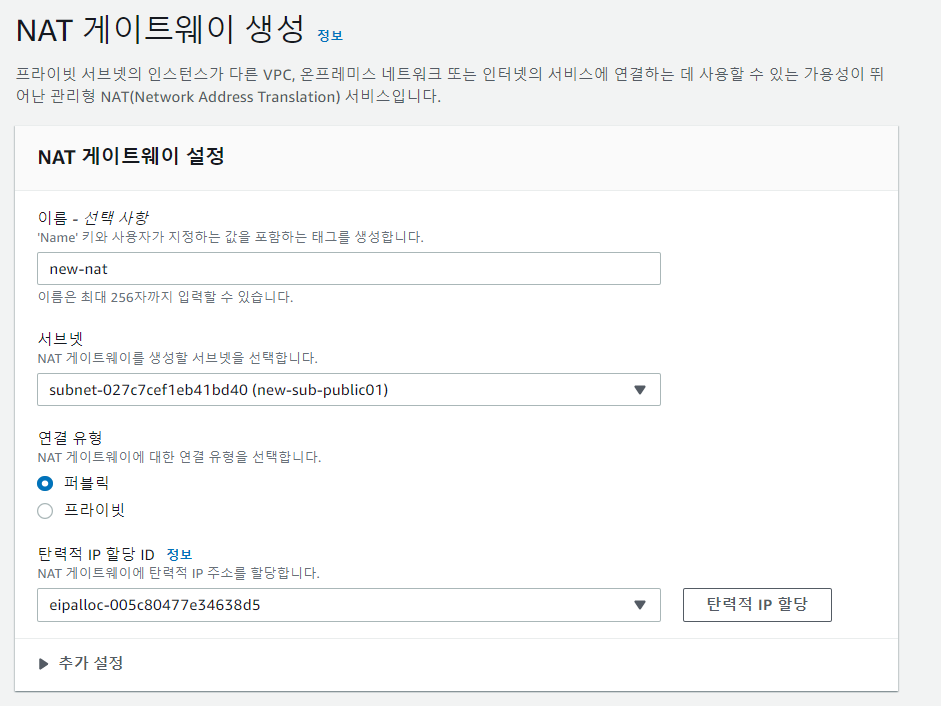
nat 게이트웨이를 만들때 탄력적IP할당 버튼을 눌러 ID를 생성한다.

# 라우팅 테이블
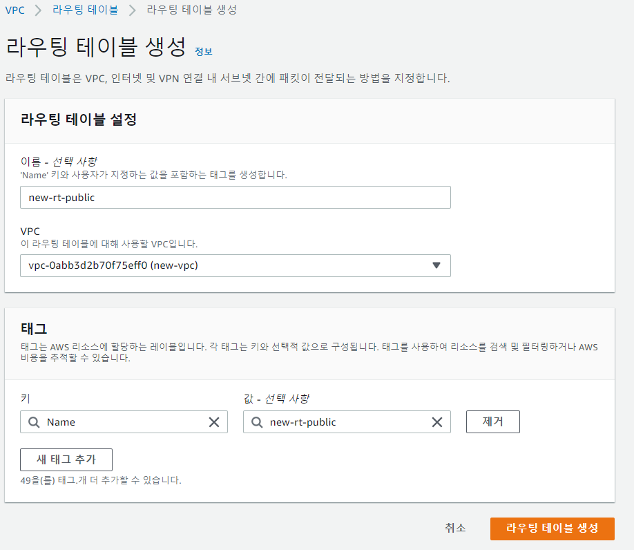

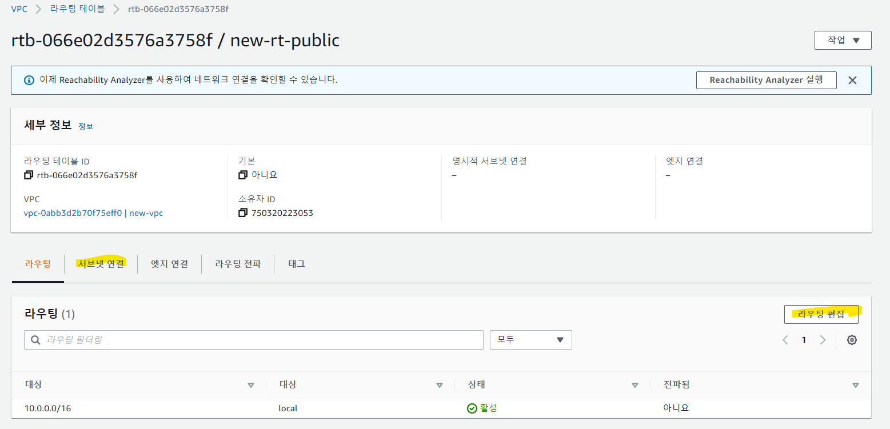
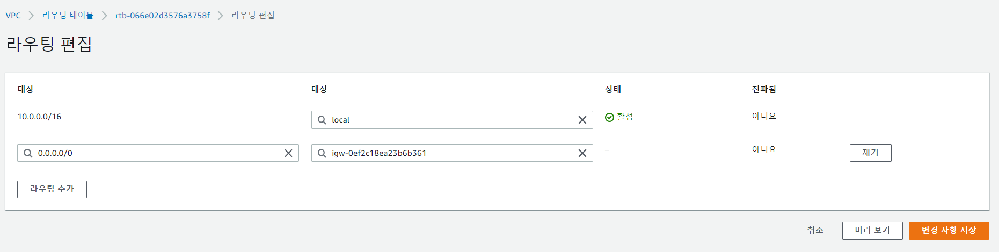
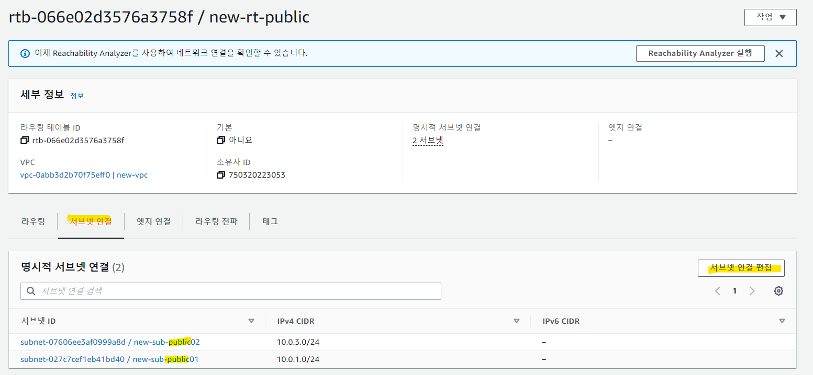

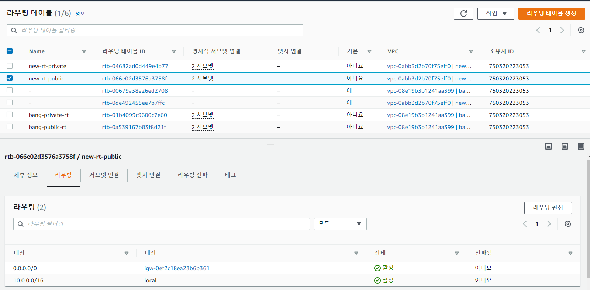

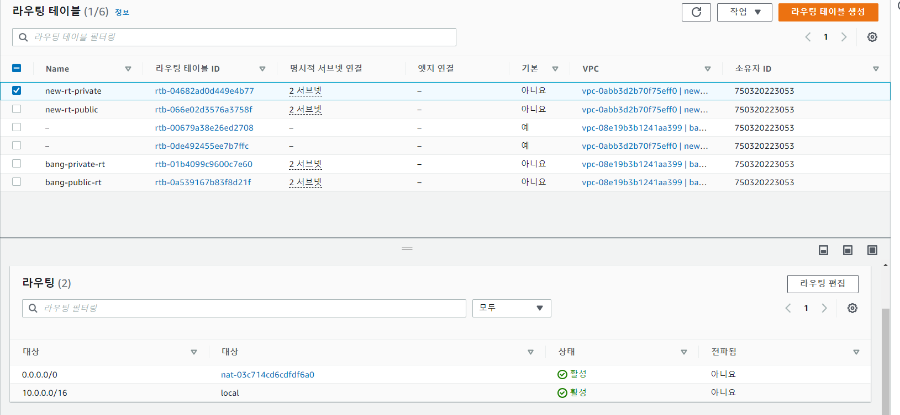

# 보안그룹
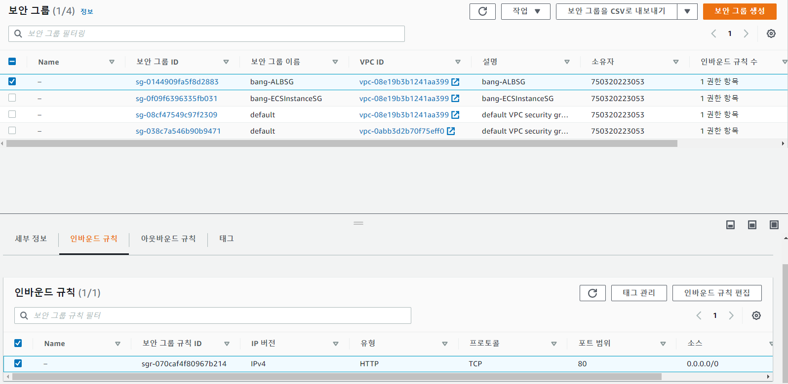

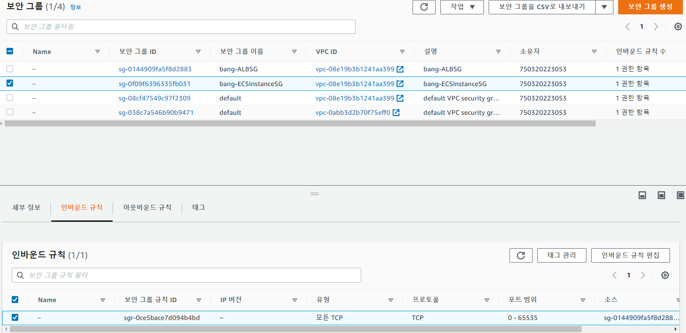

# 성공
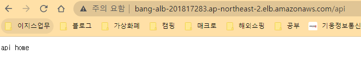

