# aegisapi
이지스 오픈 api

### Spring Boot
The following guides illustrate how to use some features concretely:

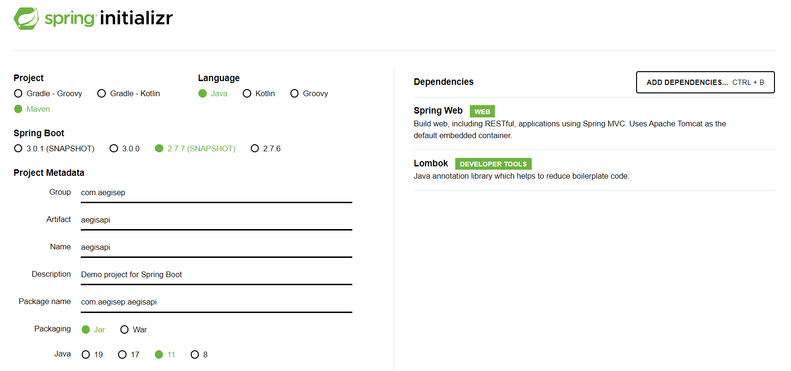

# VPC 설정하기 위해 아래 메뉴에서 작업이 필요함

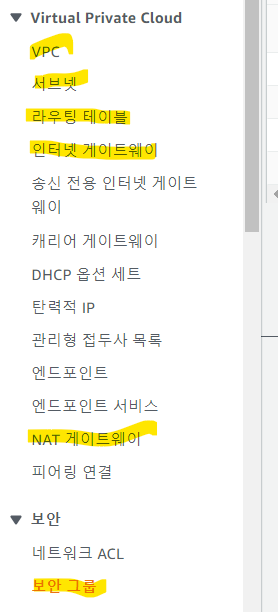

# VPC

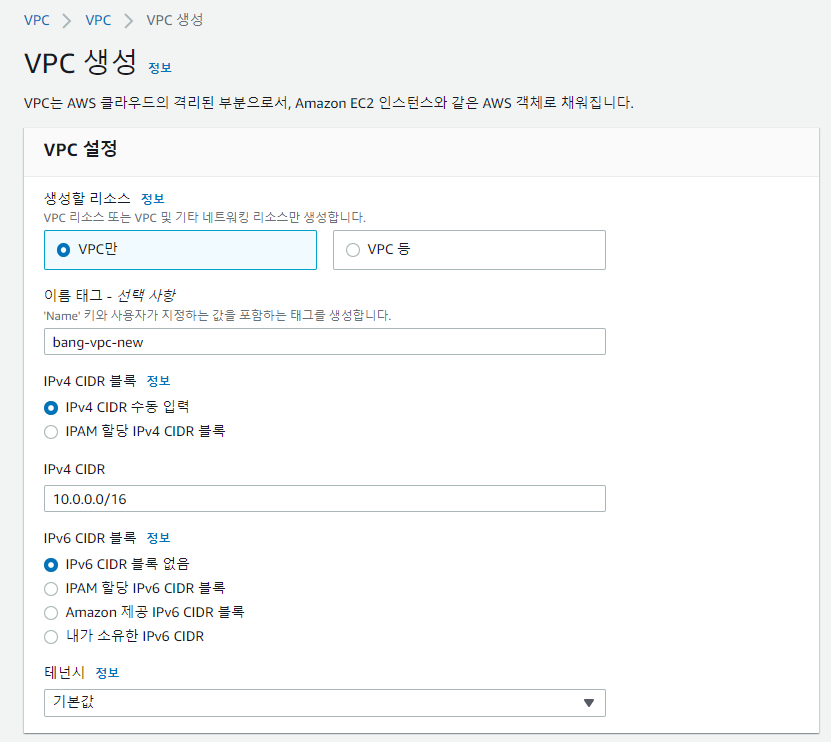

vpc 이름은 new-vpc

# Subnet

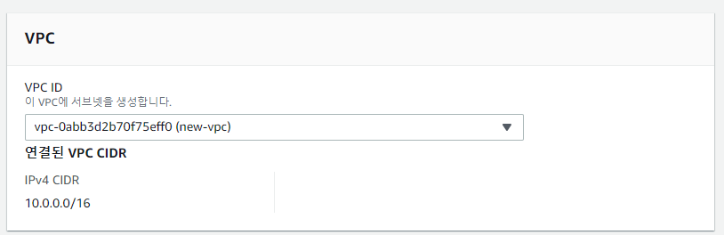

서브넷은 총 4개 만드는데 public01, private01은
같은 가용영역으로 만든다.

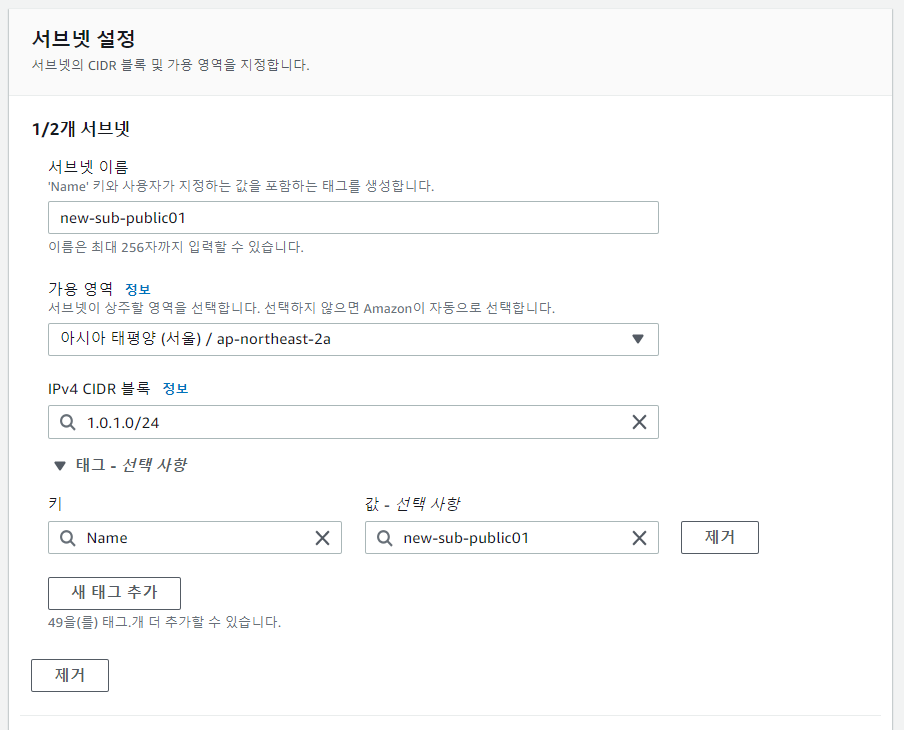
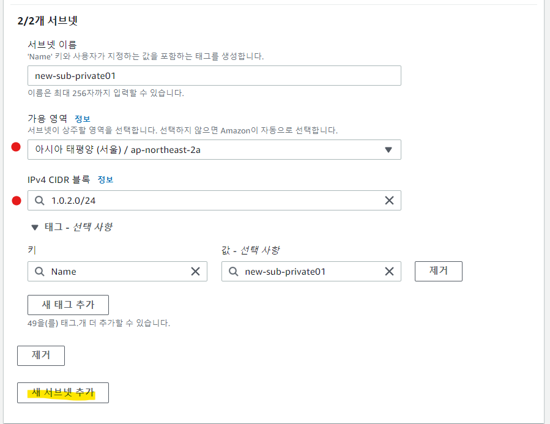

public01, private01 서브넷은 가용영역을 ap-northeast-2a에 만들고,\
public02, private02 서브넷은 가용영역을 ap-northeast-2b에 만든다.\
다 만들고 나면 아래와 같이 목록이 생성되어야 한다.

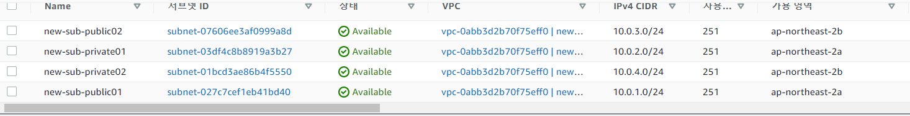

# 인터넷 게이트웨이

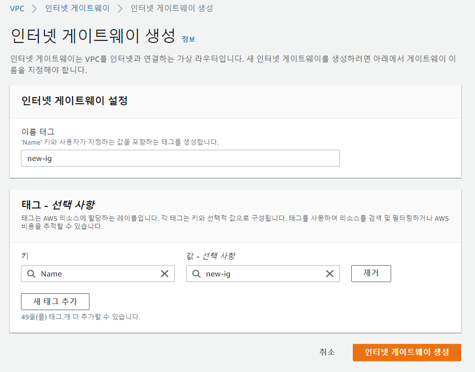

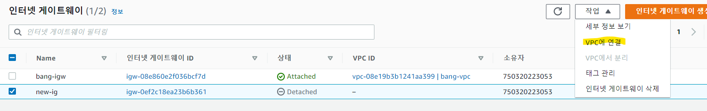

인터넷 게이트 웨이를 생성 후 VPC에 연결해준다.

# NAT 게이트웨이
※ nat 게이트웨이를 생성 하기 전 인터넷 게이트웨이가 VPC에 연결 되어 있어야 한다.

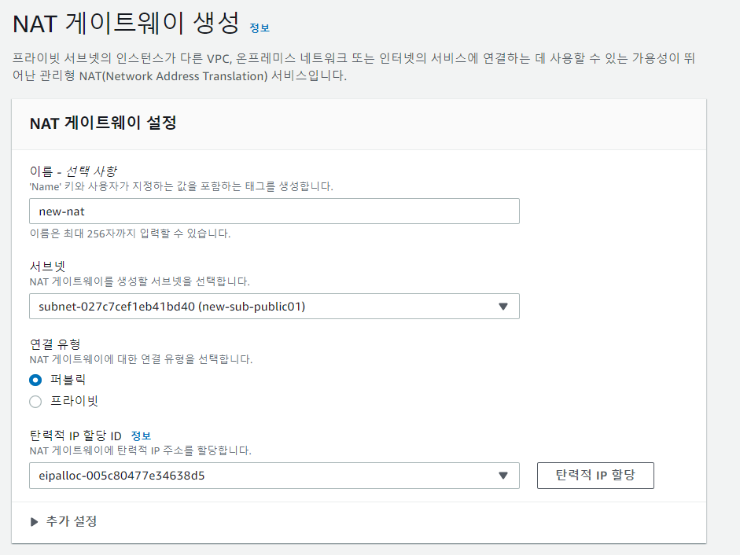

nat 게이트웨이를 만들때 탄력적IP할당 버튼을 눌러 ID를 생성한다.

# 라우팅 테이블

라우팅 테이블을 public, private 두 가지를 생성한다. \
생성 후 라우팅 편집을 통해 public에는 인터넷 게이트웨이 추가 \
private에는 nat 게이트웨이를 추가한다. 

public 라우팅 테이블에는 public 서브넷 연결 \
private 라우팅 테이블에는 private 서브넷 연결을 연결한다.

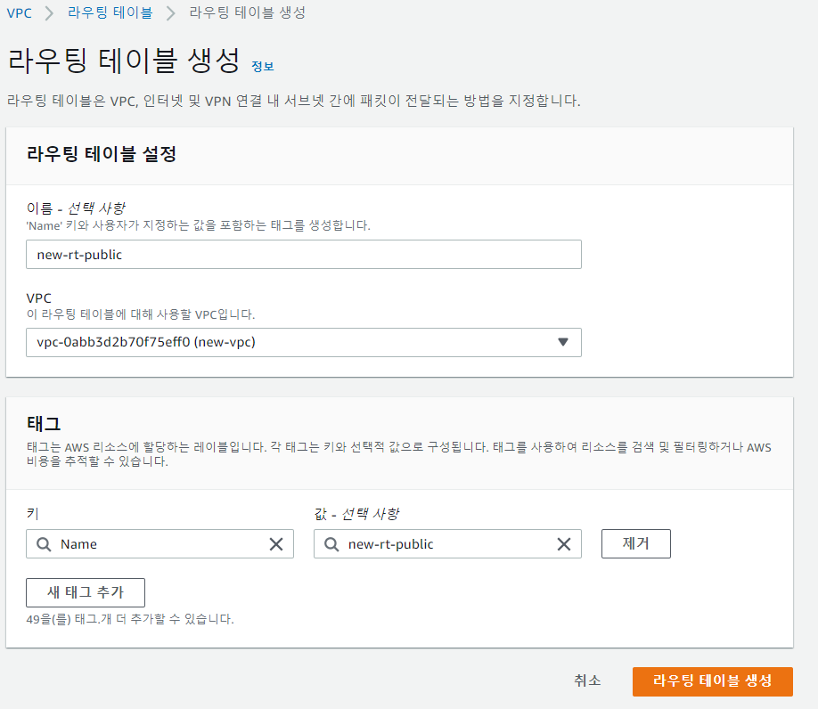

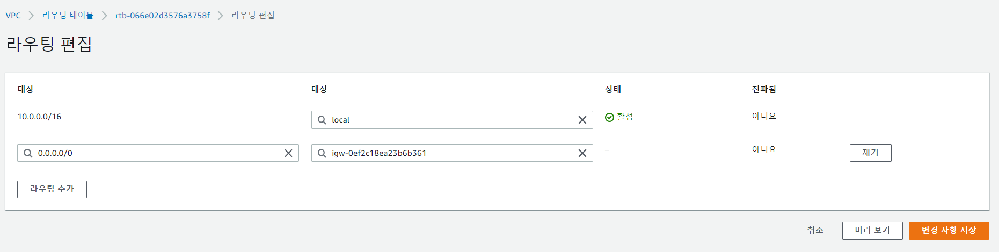
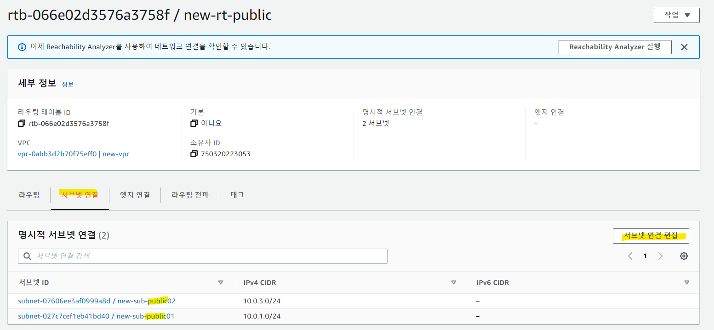

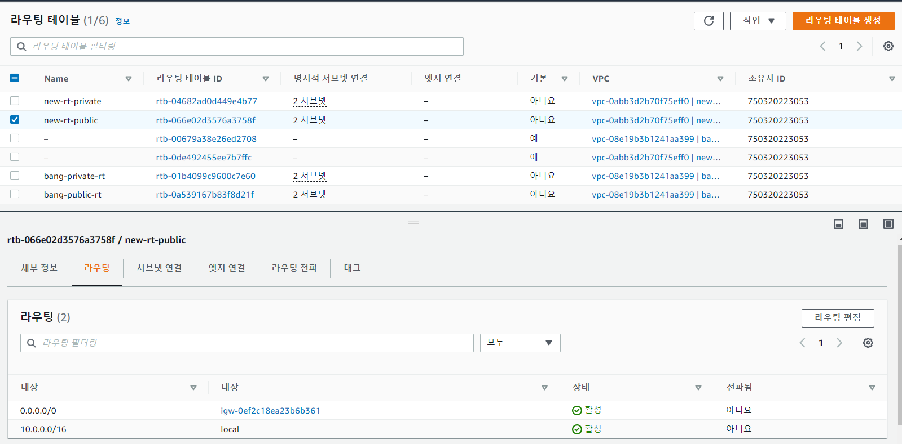

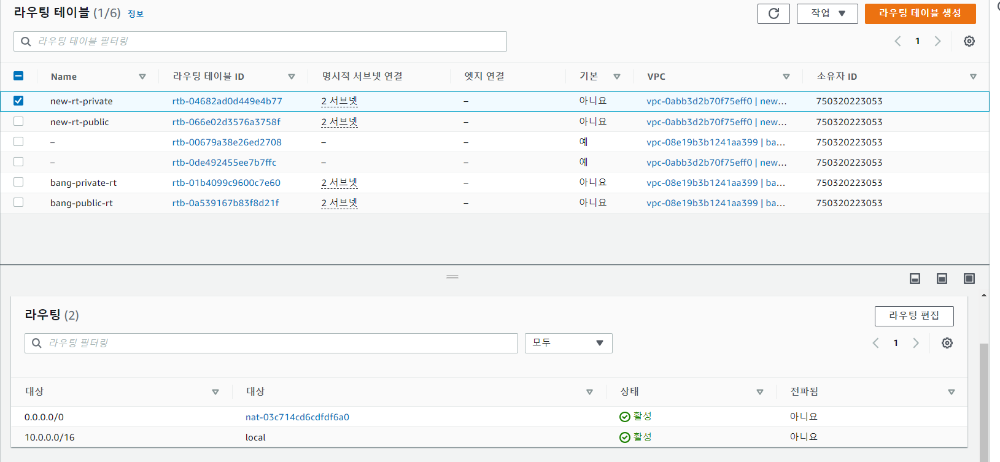

# 보안그룹

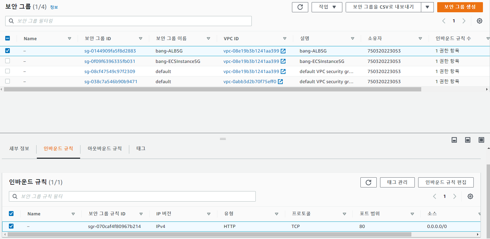

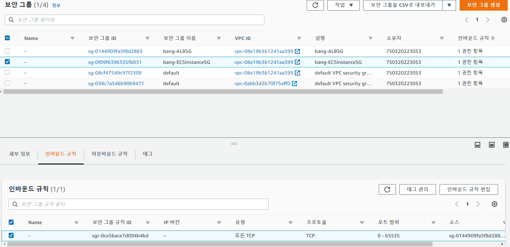

# 성공
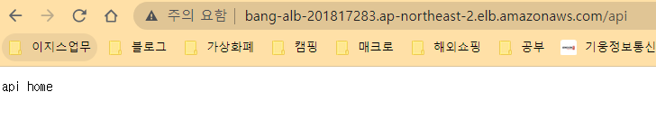

